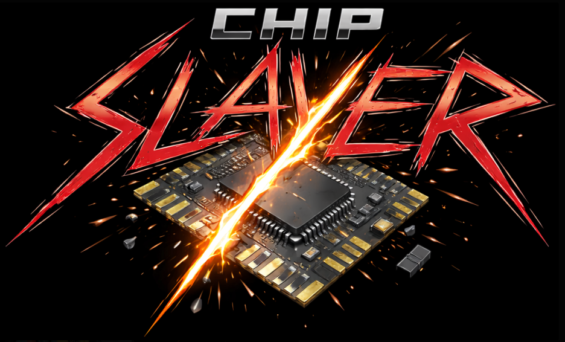

# PS2-Chip-Slayer

> [!IMPORTANT]
> PS2-Chip-Slayer is currently in private development.
>
> This public repository exists to document the project name, ownership, development status, and public-facing goals of the FBD PS2-Chip-Slayer project.
>
> This is not an open-source hardware or manufacturing release.
>
> Production hardware files, PCB files, Gerber files, KiCad design files, manufacturing files, detailed installation methods, test data, and internal development notes are intentionally not included.
>
> No permission is granted to manufacture, clone, sell, rehost, redistribute, or create derivative hardware based on this project without written permission from Fat Bald Dad / FBD Retro Game.

PS2-Chip-Slayer is an FBD / Fat Bald Dad project.

PS2-Chip-Slayer is a PlayStation 2 modchip enable/disable and isolation interface project.

The project is currently in private development.

This public repository exists for project identification, ownership record, brand awareness, and high-level public documentation.

This repository is not an open-source hardware or manufacturing release.

Production hardware files, PCB files, Gerbers, KiCad files, manufacturing files, detailed installation methods, test data, and internal development notes are intentionally not included.

No permission is granted to manufacture, clone, sell, rehost, redistribute, or create derivative hardware/products from this project without written permission from Fat Bald Dad / FBD Retro Game.
